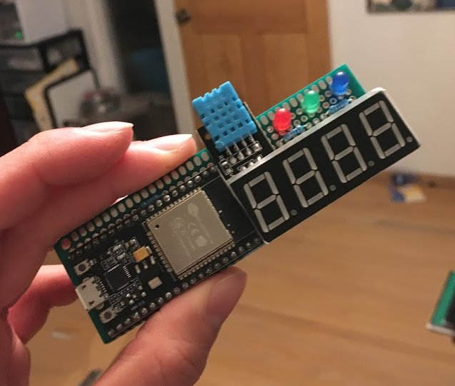

# esp32 thermostat

## Todo
* wifi manager for setting up mqtt

## MQTT Topics and Payloads
* `esp32-temp/out/#`: topics this device is subscribed to
    - `esp32-temp/out/dht11`: change the display data type
        + `TEMPC`: show Celcius
        + `TEMPF`: show Farenheit
        + `HUMI`: show hummidity
    - `esp32-temp/out/blink`: toggle the led blink when reconnecting to MQTT on the device
        + `ON`: turn on led blink when devices is disconnected from MQTT
        + `OFF`: turn off led blink when device is disconnected from MQTT
* `esp32-temp/in/#`: topics this device publishes to
    - `esp-temp/in/dht11`
        + publishes a string with the current temperature and humidity in the format: `$temp:<temperature>;humi:<humidity>#`
        + publishes an acknowledgment if the display data is changed
            + if display is changed to `TEMPC`, sends back `DISPLAYING:TEMPC`
    - `esp-temp/in/blink`
        + publishes an acknowledgement if the blink setting is changed, response is either `ON` or `OFF`

## Tasks
There is a mutex for the serial port, usable with macros `SERIALTAKE` and `SERIALGIVE`.

### sensor task
* poll dht11
* send sensor data to display task
* send sensor data to mqtt publishing task
* check button queue

### display task
* refresh 4digit7seg display using hardware timer interrupt
* dequeue dht data and display

### button task
* wait for button isr
* if button pressed, send message via queue to sensor task to change data being send to display task

*_(bx = button)_

### MQTT task
* recieve messages via callback
    * enqueue messages to sensor task to change data being displayed on display task
* reconnect
* manage mqtt publishing message queue

### led task
* changes leds based on the comfort level
    - gets comfort level from the sensor task
    - peeks at the display queue to sync the segment display with the leds

## Queues
* dht_queue: SENSOR TASK -> DISPLAY TASK
    - used to send data to display
* bx_queue: BX TASK -> SENSOR_TASK
    - MQTT TASK -> SENSOR TASK
    - used to change what data type is being sent to display
* mqtt_pub_queue: SENSOR TASK -> MQTT TASK
    - used to publish sensor data over MQTT
* comfort_queue: SENSOR TASK -> LED TASK
    - used to send comfort data to the led task

## Libraries
* Seg: 4 digit 7 segement library built for this project.
* [WiFiManager](https://github.com/tzapu/WiFiManager): AP mode for WiFi management
    + Manually installed due to platformio error.
* [DHTesp](https://github.com/beegee-tokyo/DHTesp): DHT11 library for ESP32 which blocks interrupts when polling sensor.
* [PubSubClient](https://github.com/knolleary/pubsubclient/): MQTT publishing and subscribing

# DHT11
* response time: 6s min, 10s typical, 15s max
### humidity
characteristic | spec
----- | -----
range | 20-90% RH
tolerance | +- 5%
### temp
characteristic | spec
----- | -----
range | 0-50 degC
tolerance | +- 2 degC

## resources
* [4 digit 7 segment display](https://osoyoo.com/2017/08/08/arduino-lesson-4-digit-7-segment-led-display/)
* [dht 11 esp lib](https://github.com/beegee-tokyo/DHTesp)

### mosquitto cheat sheet
* Publish: `mosquitto_pub -h <ipaddress> -m "<message>" -t <topic>`
* Subscribe: `mosquitto_sub -h <ipaddress> -t <topic>`
* Starting a server: `mosquitto -c /etc/mosquitto/mosquitto.conf -v`
    - `-c`: specify config file
    - `-v`: verbose

__#__ is a wild card.
